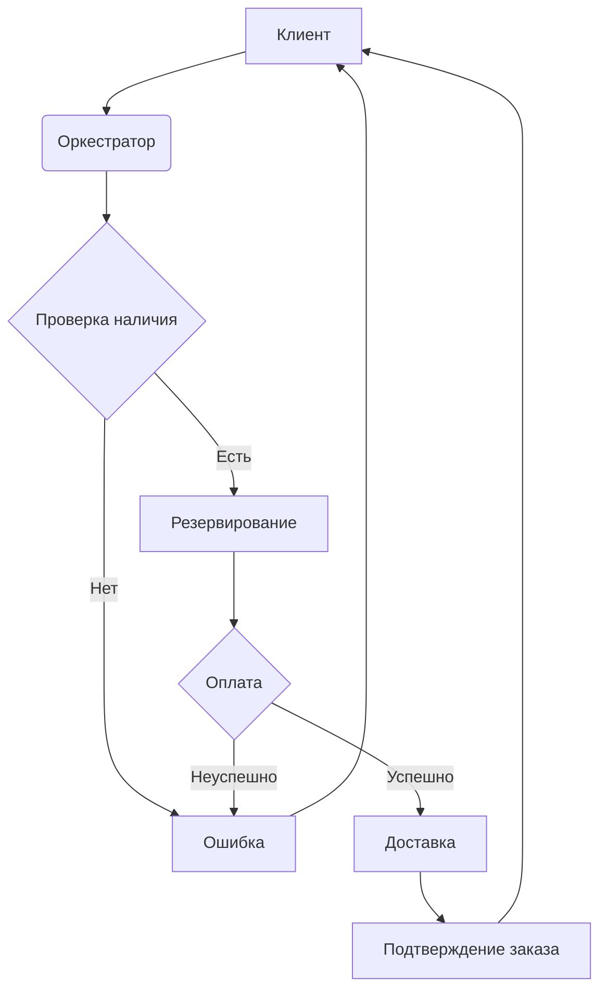
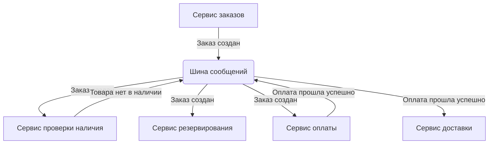

#orchestrationVScoreography #microservices #orchestration #choreography #architecture #design #distributedSystems #integration #coupling #scalability

# Оркестрация против Хореографии в Микросервисах

```table-of-contents
```

## Введение в Оркестрацию и Хореографию

В контексте микросервисной архитектуры взаимодействие между сервисами является критически важным аспектом. Существуют два основных подхода к организации этого взаимодействия: оркестрация (Orchestration) и хореография (Choreography). Оба подхода имеют свои преимущества и недостатки, и выбор между ними зависит от конкретных требований к системе, её сложности и масштабируемости.

## Оркестрация (Orchestration)

Оркестрация в микросервисах предполагает наличие центрального сервиса-оркестратора, который управляет взаимодействием между всеми остальными сервисами. Этот оркестратор действует как "дирижер", определяя последовательность вызовов сервисов, обрабатывая ответы и управляя транзакциями.

### Принцип работы Оркестрации

1.  **Централизованное управление:** Оркестратор получает запрос от клиента или другого сервиса.
2.  **Управление потоком:** Оркестратор определяет, какие сервисы должны быть вызваны и в каком порядке.
3.  **Вызов сервисов:** Оркестратор отправляет запросы к соответствующим сервисам.
4.  **Обработка ответов:** Оркестратор получает ответы от сервисов, обрабатывает их и, при необходимости, агрегирует.
5.  **Возврат результата:** Оркестратор возвращает окончательный результат клиенту или другому сервису.

### Преимущества Оркестрации

*   **Простота понимания и реализации:** Логика взаимодействия сосредоточена в одном месте, что упрощает отладку и внесение изменений.
*   **Централизованный контроль:** Оркестратор обеспечивает полный контроль над потоком выполнения, что упрощает управление транзакциями и обработку ошибок.
*   **Легкость мониторинга:** Все взаимодействия проходят через оркестратор, что облегчает сбор метрик и мониторинг производительности.

### Недостатки Оркестрации

*   **Единая точка отказа:** Выход из строя оркестратора может привести к неработоспособности всей системы.
*   **Увеличение задержек:** Все запросы проходят через оркестратор, что может увеличивать время отклика.
*   **Связанность (Coupling):** Оркестратор тесно связан со всеми сервисами, которыми он управляет, что затрудняет независимое развертывание и масштабирование.
*   **Сложность масштабирования:** Масштабирование оркестратора может быть более сложным, чем масштабирование отдельных сервисов.

### Пример Оркестрации

Рассмотрим пример системы электронной коммерции. Оркестратор может обрабатывать заказ следующим образом:

1.  Получает запрос на создание заказа.
2.  Вызывает сервис проверки наличия товара.
3.  Если товар есть в наличии, вызывает сервис резервирования товара.
4.  Вызывает сервис оплаты.
5.  Если оплата прошла успешно, вызывает сервис доставки.
6.  Возвращает клиенту подтверждение заказа.



## Хореография (Choreography)

Хореография, в отличие от оркестрации, не имеет центрального управляющего элемента. Вместо этого сервисы взаимодействуют друг с другом напрямую, обмениваясь сообщениями через шину сообщений (message bus) или брокер сообщений (message broker). Каждый сервис "слушает" определенные события и реагирует на них, выполняя свою часть работы.

### Принцип работы Хореографии

1.  **Публикация событий:** Сервис публикует событие (например, "Заказ создан") в шину сообщений.
2.  **Подписка на события:** Другие сервисы, заинтересованные в этом событии, подписаны на него.
3.  **Обработка событий:** Каждый подписчик получает событие и выполняет свою логику (например, сервис оплаты обрабатывает событие "Заказ создан" и инициирует процесс оплаты).
4.  **Публикация новых событий:** После выполнения своей части работы сервис может опубликовать новое событие (например, "Оплата прошла успешно").

### Преимущества Хореографии

*   **Слабая связанность (Loose Coupling):** Сервисы не зависят друг от друга напрямую, что упрощает их независимое развертывание и масштабирование.
*   **Гибкость:** Легко добавлять новые сервисы или изменять существующие, не затрагивая другие части системы.
*   **Масштабируемость:** Легко масштабировать отдельные сервисы, так как они не зависят от центрального оркестратора.
*   **Отказоустойчивость:** Выход из строя одного сервиса не обязательно влияет на работу других сервисов.

### Недостатки Хореографии

*   **Сложность понимания и отладки:** Логика взаимодействия распределена между несколькими сервисами, что затрудняет отслеживание потока выполнения и выявление ошибок.
*   **Сложность мониторинга:** Требуется более сложная система мониторинга, чтобы отслеживать взаимодействие между сервисами.
*   **Сложность управления транзакциями:** Обеспечение согласованности данных между несколькими сервисами может быть сложной задачей.
* **Дублирование логики:** Может возникнуть дублирование логики в разных сервисах, если несколько сервисов должны реагировать на одно и то же событие схожим образом.

### Пример Хореографии

В том же примере системы электронной коммерции хореография может работать следующим образом:

1.  Сервис заказов публикует событие "Заказ создан".
2.  Сервис проверки наличия товара получает это событие и проверяет наличие товара. Если товара нет, публикует событие "Товара нет в наличии".
3.  Сервис резервирования товара получает событие "Заказ создан" и резервирует товар.
4.  Сервис оплаты получает событие "Заказ создан" и инициирует процесс оплаты. Если оплата прошла успешно, публикует событие "Оплата прошла успешно".
5.  Сервис доставки получает событие "Оплата прошла успешно" и организует доставку.



## Сравнение Оркестрации и Хореографии

| Характеристика       | Оркестрация                                                                          | Хореография                                                                                    |
| --------------------- | ------------------------------------------------------------------------------------- | ---------------------------------------------------------------------------------------------- |
| Управление          | Централизованное (оркестратор)                                                      | Децентрализованное (сервисы взаимодействуют напрямую)                                        |
| Связанность          | Высокая (оркестратор тесно связан с сервисами)                                        | Низкая (сервисы слабо связаны)                                                                 |
| Сложность           | Проще в понимании и реализации                                                        | Сложнее в понимании и отладке                                                               |
| Масштабируемость    | Сложнее масштабировать оркестратор                                                      | Легче масштабировать отдельные сервисы                                                      |
| Отказоустойчивость   | Единая точка отказа (оркестратор)                                                       | Более отказоустойчивая (выход из строя одного сервиса не влияет на другие)                   |
| Мониторинг          | Проще (все взаимодействия проходят через оркестратор)                                    | Сложнее (требуется более сложная система мониторинга)                                     |
| Транзакции          | Проще управлять (оркестратор управляет транзакциями)                                  | Сложнее управлять (требуется распределенное управление транзакциями)                       |
| Гибкость            | Менее гибкая (изменения в оркестраторе могут затрагивать другие сервисы)              | Более гибкая (легко добавлять новые сервисы или изменять существующие)                       |
| Применимость        | Простые бизнес-процессы с четко определенной последовательностью действий                | Сложные бизнес-процессы с большим количеством сервисов и непредсказуемыми взаимодействиями |

## Выбор между Оркестрацией и Хореографией: Рекомендации и Паттерны

Выбор между оркестрацией и хореографией не является однозначным и зависит от множества факторов. Вот несколько рекомендаций, которые помогут сделать правильный выбор:

* **Сложность бизнес-процесса:** Для простых процессов с четко определенной последовательностью действий лучше подходит оркестрация. Для сложных процессов с большим количеством сервисов и непредсказуемыми взаимодействиями лучше подходит хореография.

* **Требования к масштабируемости:** Если требуется высокая масштабируемость отдельных сервисов, лучше выбрать хореографию.

* **Требования к отказоустойчивости:** Если требуется высокая отказоустойчивость, лучше выбрать хореографию.

* **Команда и опыт:** Если команда имеет опыт работы с оркестрацией и не имеет опыта работы с хореографией, лучше начать с оркестрации.

* **Размер системы:** Для небольших систем с небольшим количеством сервисов лучше подходит оркестрация. Для больших систем с большим количеством сервисов лучше подходит хореография.

**Паттерны, используемые в Оркестрации:**

*   **API Gateway:** Централизованная точка входа для всех запросов к системе. API Gateway может выполнять функции оркестратора.
*   **Backend for Frontend (BFF):** Специализированный оркестратор для конкретного клиентского приложения.
*   **Saga:** Паттерн для управления распределенными транзакциями в микросервисной архитектуре. Сага может быть реализована как с помощью оркестрации, так и с помощью хореографии. [[Saga Pattern]]

**Паттерны, используемые в Хореографии:**

*   **Publish-Subscribe:** Паттерн, при котором сервисы публикуют события в шину сообщений, а другие сервисы подписываются на эти события.
*   **Event Sourcing:** Паттерн, при котором состояние системы сохраняется в виде последовательности событий. [[Event Sourcing]]
*   **CQRS (Command Query Responsibility Segregation):** Паттерн, при котором разделяются операции чтения и записи данных. [[CQRS]]
*  **Choreography-based Saga:** Реализация паттерна Saga с использованием хореографии.

## Реализация на Go

### Пример Оркестрации (простой)

```go
package main

import (
	"fmt"
	"log"
	"net/http"
)

// Сервисы (имитация)
func serviceA(w http.ResponseWriter, r *http.Request) {
	fmt.Fprintln(w, "Service A executed")
}

func serviceB(w http.ResponseWriter, r *http.Request) {
	fmt.Fprintln(w, "Service B executed")
}

// Оркестратор
func orchestrator(w http.ResponseWriter, r *http.Request) {
	// Вызов сервиса A
	serviceA(w, r)
	// Вызов сервиса B
	serviceB(w, r)

	fmt.Fprintln(w, "Orchestration completed")
}

func main() {
	http.HandleFunc("/orchestrate", orchestrator)
	log.Fatal(http.ListenAndServe(":8080", nil))
}
```

В этом примере `orchestrator` является функцией-оркестратором, которая последовательно вызывает `serviceA` и `serviceB`. Это простейший пример, демонстрирующий принцип оркестрации. В реальном приложении оркестратор был бы более сложным, обрабатывал бы ошибки, управлял бы транзакциями и т.д.

### Пример Хореографии (с использованием NATS)

```go
package main

import (
	"fmt"
	"log"
	"time"

	"github.com/nats-io/nats.go"
)

func main() {
	// Подключение к NATS
	nc, err := nats.Connect(nats.DefaultURL)
	if err != nil {
		log.Fatal(err)
	}
	defer nc.Close()

	// Сервис A (подписчик)
	nc.Subscribe("event.created", func(m *nats.Msg) {
		fmt.Printf("Service A received: %s\n", string(m.Data))
		// Обработка события...
		time.Sleep(1 * time.Second) // Имитация обработки
		// Публикация нового события
		nc.Publish("event.processed.by.a", []byte("Processed by A"))
	})

	// Сервис B (подписчик)
	nc.Subscribe("event.processed.by.a", func(m *nats.Msg) {
		fmt.Printf("Service B received: %s\n", string(m.Data))
		// Обработка события...
	})

	// Сервис-публикатор (имитация)
	go func() {
		for i := 0; i < 5; i++ {
			msg := fmt.Sprintf("Event %d", i)
			nc.Publish("event.created", []byte(msg))
			fmt.Printf("Published: %s\n", msg)
			time.Sleep(500 * time.Millisecond)
		}
	}()

	// Ожидание (чтобы программа не завершилась сразу)
	select {}
}
```

В этом примере используется библиотека NATS для реализации обмена сообщениями. Сервис-публикатор публикует события "event.created". Сервис A подписывается на эти события, обрабатывает их и публикует новые события "event.processed.by.a". Сервис B подписывается на события "event.processed.by.a" и обрабатывает их.  Это демонстрирует принцип хореографии, где сервисы взаимодействуют друг с другом асинхронно через шину сообщений.

## Заключение

Оркестрация и хореография – два мощных подхода к организации взаимодействия микросервисов.  Выбор между ними зависит от конкретных требований к системе, её сложности, масштабируемости и опыта команды.  Не существует "серебряной пули", и в некоторых случаях может быть целесообразно комбинировать оба подхода. Важно понимать преимущества и недостатки каждого подхода, чтобы сделать осознанный выбор и построить эффективную и надежную микросервисную архитектуру.

```old
В микросервисной архитектуре существуют два подхода к взаимодействию микросервисов: оркестрация и хореография.

**Оркестрация** подразумевает, что один централизованный сервис контролирует все коммуникации и направляет каждый сервис выполнять предназначенную функцию. Это можно сравнить с дирижером, который активно контролирует все элементы и взаимодействия, как дирижер управляет музыкантами оркестра.

**Хореография** же предполагает, что каждый микросервис сам определяет, как и когда ему следует взаимодействовать с другими сервисами. В хореографированной системе нет центрального сервиса, оркеструющего поток коммуникации между сервисами. Вместо этого каждый сервис напрямую общается с другими, обмениваясь сообщениями по мере необходимости для выполнения своих задач. Это можно сравнить с танцем, где участники следуют установленному паттерну или рутине по мере того, как играет музыка, без необходимости наблюдения и инструкций.

Выбор между хореографией и оркестрацией в микросервисах будет влиять на то, насколько бесшовно функционируют сервисы за кулисами.

```