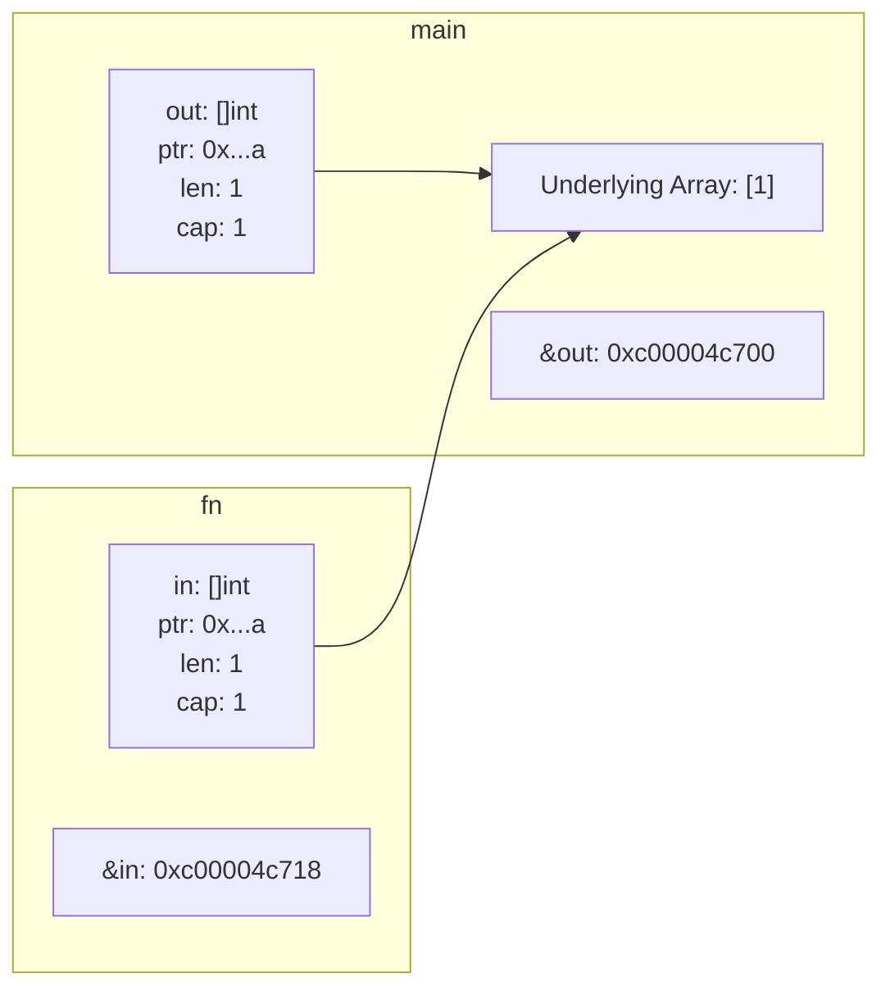
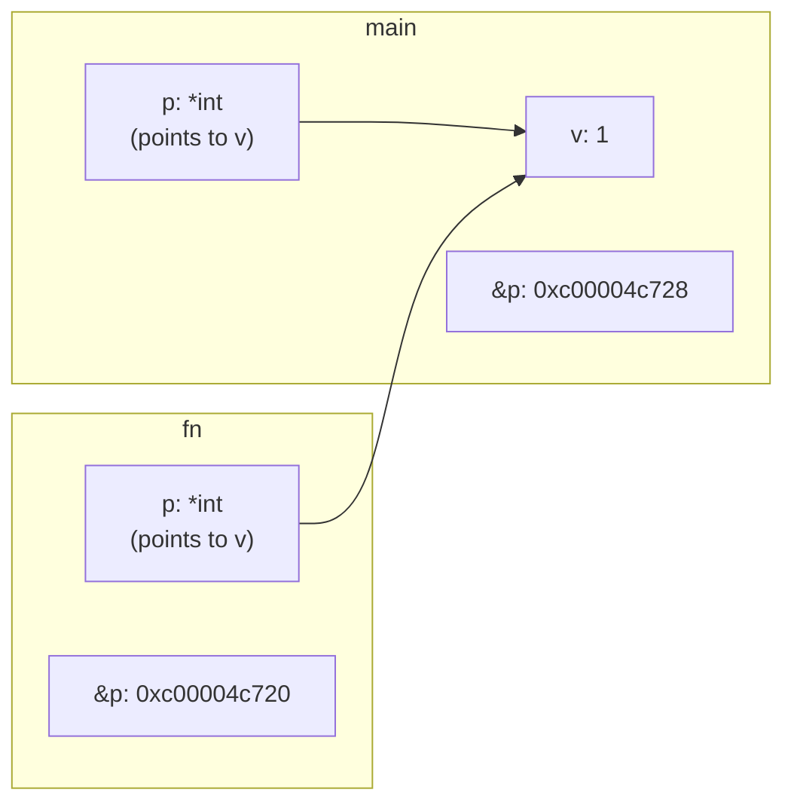

#functionArguments #go #programming #pointers #slices #memory #copying #passbyvalue

# Аргументы функций в Go: Копирование и его последствия

```table-of-contents
```

## Введение в копирование аргументов

В Go аргументы функций **всегда** передаются по значению. Это означает, что при вызове функции создается копия каждого аргумента, и функция работает именно с этими копиями, а не с оригиналами переменных, переданных в качестве аргументов. Это фундаментальный принцип Go, который влияет на то, как мы пишем и понимаем код, особенно когда речь идет о структурах данных, таких как срезы (slices) и указатели (pointers).

## Копирование срезов (Slices)

Рассмотрим пример со срезом:

```go
func fn(in []int) {
	println(&in) // 0xc00004c718
}

func main() {
	out := []int{1}
	println(&out) // 0xc00004c700
	fn(out)
}
```

В этом примере, `out` - это срез, содержащий один элемент. Когда мы вызываем `fn(out)`, создается копия `out` и передается в функцию `fn`. Важно понимать, что срез в Go – это не сам массив данных, а структура, содержащая три поля:

1.  Указатель на базовый массив (pointer to the underlying array).
2.  Длина среза (length).
3.  Емкость среза (capacity).

    Все эти три элемента структуры копируются. Когда мы делаем `println(&in)` внутри `fn`, мы видим адрес *копии* структуры среза `in`, а не адрес оригинального среза `out`. Адреса разные, потому что `in` и `out` - это две разные переменные, находящиеся в разных местах памяти. Однако, обе переменные (`in` и `out`) содержат указатель на *один и тот же* базовый массив.

### Иллюстрация копирования среза



На схеме видно, что `out` и `in` – это разные структуры (с разными адресами), но они обе указывают на один и тот же базовый массив.

### Последствия копирования срезов

*   **Изменения внутри функции:** Если функция `fn` изменяет элементы среза `in` (например, `in[0] = 2`), эти изменения *будут* видны и в `out`, потому что обе переменные ссылаются на один и тот же базовый массив.
*   **Добавление элементов:** Если функция `fn` добавляет элементы к срезу `in` с помощью `append`, и при этом емкости `in` достаточно, то добавленные элементы также будут видны в `out`.
*   **Перераспределение памяти (Reallocation):** Если `fn` добавляет элементы к `in` с помощью `append`, и при этом емкости `in` *недостаточно*, то Go выделит новый, больший базовый массив, скопирует туда существующие элементы `in` и добавит новые. В этом случае `in` будет указывать на новый массив, а `out` – на старый. Изменения в `in` после этого момента *не* будут видны в `out`.

## Копирование указателей (Pointers)

Теперь рассмотрим пример с указателем:

```go
func fn(p *int) {
	println(&p) // 0xc00004c720
}

func main() {
	v := 1
	p := &v
	println(&p) // 0xc00004c728
	fn(p)
}
```

В этом примере, `p` - это указатель на переменную `v`. Когда мы вызываем `fn(p)`, создается *копия* указателя `p` и передается в `fn`. Копия указателя имеет другой адрес (`&p` внутри `fn` отличается от `&p` в `main`), но обе копии указывают на *одну и ту же* переменную `v`.

### Иллюстрация копирования указателя



### Последствия копирования указателей

*   **Изменения значения:** Если функция `fn` изменяет значение, на которое указывает `p` (например, `*p = 2`), эти изменения *будут* видны и в `main`, потому что оба указателя (оригинал и копия) указывают на одну и ту же область памяти (`v`).
*   **Изменение самого указателя:** Если функция `fn` изменяет сам указатель `p` (например, присваивает ему адрес другой переменной), это изменение *не* будет видно в `main`, потому что `fn` работает с копией указателя.

## Сравнение копирования срезов и указателей

| Свойство                                 | Срез                                                                                                                                                                                                                                                           | Указатель                                                                                                                                                                                                                                                               |
| :--------------------------------------- | :--------------------------------------------------------------------------------------------------------------------------------------------------------------------------------------------------------------------------------------------------------------- | :--------------------------------------------------------------------------------------------------------------------------------------------------------------------------------------------------------------------------------------------------------------------- |
| **Что копируется**                        | Копируется структура среза (указатель на базовый массив, длина, емкость).                                                                                                                                                                                 | Копируется значение указателя (адрес переменной, на которую он указывает).                                                                                                                                                                                     |
| **Изменения элементов/значения**          | Изменения элементов видны в вызывающей функции, т.к. оба среза (оригинал и копия) указывают на один и тот же базовый массив.                                                                                                                               | Изменения значения, на которое указывает указатель, видны в вызывающей функции, т.к. оба указателя (оригинал и копия) указывают на одну и ту же переменную.                                                                                                       |
| **Изменения самого среза/указателя** | Если происходит перераспределение базового массива (reallocation) при добавлении элементов к срезу внутри функции, то изменения не видны в вызывающей функции. Если емкости достаточно, добавленные элементы будут видны.                                       | Изменения самого указателя (присваивание ему другого адреса) не видны в вызывающей функции, т.к. функция работает с копией указателя.                                                                                                                              |
| **Пример**                               | ```go func modifySlice(s []int) { s[0] = 100 // Видно снаружи s = append(s, 200) // Может быть видно, если не было reallocation } ```                                                                                                                        | ```go func modifyPointer(p *int) { *p = 100 // Видно снаружи var x int p = &x       // Не видно снаружи } ```                                                                                                                                             |
| **Когда использовать**                | Когда нужно работать с коллекцией элементов и, возможно, изменять ее размер. Важно помнить о потенциальном перераспределении памяти.                                                                                                                        | Когда нужно изменить значение переменной внутри функции, или когда нужно передать "ссылку" на объект без его копирования (например, для больших структур данных), или когда нужно иметь возможность передать `nil` (нулевой указатель).                                  |
| **[[Zero value]]**                    | `nil` (все поля структуры среза имеют нулевые значения: указатель на базовый массив = `nil`, длина = 0, емкость = 0).                                                                                                                                        | `nil` (указатель ни на что не указывает).                                                                                                                                                                                                                                     |
| **[[Подлежащий тип/Underlying type]]** | Тип элементов базового массива.                                                                                                                                                                                                                          | Тип переменной, на которую указывает указатель.                                                                                                                                                                                                                          |

## Заключение

Понимание того, что в Go аргументы функций всегда передаются по значению, является ключевым для написания корректного и предсказуемого кода. В случае со срезами копируется структура среза, а не сам базовый массив, что позволяет эффективно работать с большими объемами данных без полного копирования. В случае с указателями копируется сам указатель (адрес), что позволяет изменять значение переменной в вызывающей функции.  Важно учитывать разницу между изменением *значения, на которое указывает* указатель/срез, и изменением *самого* указателя/среза.

```old
аргументы функций **всегда** копируются...

...и для слайса:

\`\`\`go
func fn(in []int) {
	println(&in) // 0xc00004c718
}

func main() {
	out := []int{1}
	println(&out) // 0xc00004c700
	fn(out)
}
\`\`\`

...и для указателя:

\`\`\`go
func fn(p *int) {
	println(&p) // 0xc00004c720
}

func main() {
	v := 1
	p := &v
	println(&p) // 0xc00004c728
	fn(p)
}
\`\`\`

```