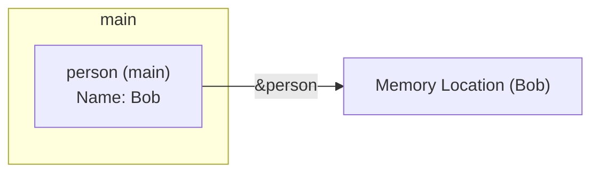
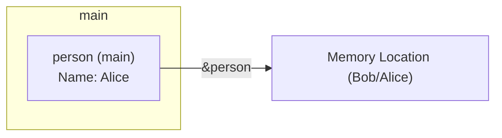

#golang #go #pass_by_value #pointers #structs #functions #parameters #memory #aliasing #scope

# Передача параметров по значению в Go

```table-of-contents
```

Рассмотрим пример кода на Go и разберем, почему он ведет себя определенным образом, а также как его можно изменить для достижения желаемого результата. Проанализируем концепции передачи параметров по значению, указателей и областей видимости.

**Исходный код:**

```go
package main

import "fmt"

type Person struct {
	Name string
}

func changeName(person *Person) {
	person = &Person{
		Name: "Alice",
	}
}

func main() {
	person := Person{
		Name: "Bob",
	}
	fmt.Println(person.Name)
	changeName(&person)
	fmt.Println(person.Name)
}
```

**Анализ исходного кода и поведения:**

1.  **Объявление структуры `Person`:**
    Определяется структура `Person` с одним полем `Name` строкового типа.  Это пользовательский тип данных.

2.  **Функция `main`:**
    *   Создается переменная `person` типа `Person` и инициализируется значением `{Name: "Bob"}`.
    *   Выводится значение `person.Name` на консоль (вывод: "Bob").
    *   Вызывается функция `changeName`, в которую передается *адрес* переменной `person` (используется оператор `&`).
    *   Снова выводится значение `person.Name` на консоль (вывод: "Bob").  Это ключевой момент, который мы разберем.

3.  **Функция `changeName`:**
    *   Принимает аргумент `person` типа `*Person`, то есть указатель на структуру `Person`. Важно понимать, что сам указатель передается *по значению*. Это значит, что создается копия указателя.
    *   Внутри функции `changeName` переменной `person` (копии указателя) присваивается адрес *нового* объекта `Person`, инициализированного значением `{Name: "Alice"}`.  Это изменение затрагивает только *локальную копию* указателя `person` внутри функции `changeName`.  Исходная переменная `person` в функции `main` остается неизменной и продолжает указывать на исходный объект `{Name: "Bob"}`.

**Почему `person.Name` в `main` не меняется:**

Ключевым моментом является понимание того, что в Go все аргументы функций передаются *по значению*.  Даже если передается указатель, копируется сам указатель (его значение - адрес в памяти), а не объект, на который он указывает.

В функции `changeName` происходит следующее:

1.  Создается копия указателя `person`.
2.  Эта копия изменяется, чтобы указывать на *новый* объект `Person` в памяти.
3.  Исходный указатель `person` в функции `main` *не изменяется* и по-прежнему указывает на исходный объект.

**Визуализация памяти (схематично):**

До вызова `changeName`:



Во время выполнения `changeName`:

```mermaid
graph LR
    subgraph main
        person_main["person (main)
        Name: Bob"]
    end
    subgraph changeName
        person_changeName["person (changeName)"]
    end
    
    person_main --> |&person (copy)| person_changeName
    person_changeName --> |&Person{Name: Alice}| memory_alice["Memory Location (Alice)"]
        person_main --> |&person| memory_bob["Memory Location (Bob)"]
```
После выполнения `changeName`:


**Исправленный код:**

Чтобы изменить имя исходного объекта `Person`, нужно модифицировать *содержимое* по указателю, а не сам указатель.

```go
package main

import "fmt"

type Person struct {
	Name string
}

func changeName(person *Person) {
	person.Name = "Alice" // Изменяем поле Name объекта, на который указывает person
}

func main() {
	person := Person{
		Name: "Bob",
	}
	fmt.Println(person.Name)
	changeName(&person)
	fmt.Println(person.Name)
}
```

**Изменения в исправленном коде:**

В функции `changeName` вместо присваивания нового значения указателю `person` используется оператор `.` для доступа к полю `Name` объекта, на который указывает `person`, и ему присваивается значение "Alice".  Теперь изменяется *исходный* объект, а не локальная копия указателя.

**Визуализация памяти (исправленный код) во время выполнения changeName:**

```mermaid
graph LR
    subgraph main
        person_main["person (main)
        Name: Bob"]
    end
    subgraph changeName
        person_changeName["person (changeName)"]
    end
    
    person_main --> |&person (copy)| person_changeName
    person_changeName --> |&person| memory_bob["Memory Location (Bob)"]
    memory_bob -.->|"person.Name = Alice"| memory_bob

```
После :

**Ключевые концепции:**

*   **Передача по значению (Pass-by-value):**  В Go аргументы функций всегда передаются по значению.  Это означает, что создается копия значения переменной, и эта копия передается в функцию.  Изменения копии не влияют на исходную переменную.

*   **Указатели (Pointers):** Указатель - это переменная, которая хранит адрес другой переменной в памяти.  Оператор `&` возвращает адрес переменной.  Оператор `*` (разыменование) позволяет получить доступ к значению, хранящемуся по адресу, на который указывает указатель.

*  **[[Область видимости (Scope)]]:** Область видимости определяет, где переменная доступна в коде. Переменные, объявленные внутри функции, имеют локальную область видимости и доступны только внутри этой функции.

**Альтернативные решения (менее предпочтительные):**

1.  **Возврат нового значения:** Функция `changeName` могла бы возвращать новое значение `Person`, и в `main` можно было бы присвоить это значение исходной переменной.

    ```go
    func changeName(person Person) Person {
        person.Name = "Alice"
        return person
    }

    func main() {
        person := Person{Name: "Bob"}
        fmt.Println(person.Name)
        person = changeName(person) // Присваиваем новое значение
        fmt.Println(person.Name)
    }
    ```
    В этом случае в `changeName` передается копия *структуры*, а не указателя. Функция изменяет копию и возвращает ее. В `main` происходит присваивание. Это работает, но создает ненужную копию всей структуры.

2. **Использование глобальной переменной:** Теоретически, можно было бы использовать глобальную переменную `Person`, но это крайне *не рекомендуется* из-за проблем с областью видимости, сложностью отладки и поддержки кода.  Глобальные переменные делают код менее предсказуемым и увеличивают вероятность ошибок.

**Преимущества использования указателей для изменения значений:**

*   **Эффективность:**  Избегается копирование больших структур данных.  Передается только адрес (обычно 4 или 8 байт), независимо от размера структуры.
*   **Изменение исходных данных:**  Позволяет функциям изменять значения переменных, переданных в качестве аргументов, что необходимо во многих случаях.
*  **[[Aliasing]]**: Позволяет иметь несколько указателей на один и тот же объект в памяти, что может быть полезно в определенных сценариях.

**Заключение:**

Понимание разницы между передачей по значению и передачей по ссылке (которой в Go в чистом виде нет, но эмулируется с помощью указателей) является фундаментальным для написания корректного и эффективного кода на Go.  Использование указателей позволяет функциям изменять значения внешних переменных, а также повышает эффективность за счет избежания ненужного копирования данных. Правильное использование указателей и понимание областей видимости - залог создания надежного и поддерживаемого кода.

```old
\`\`\`go
package main

import "fmt"

type Person struct {
	Name string
}

func changeName(person *Person) {
	person = &Person{
		Name: "Alice",
	}
}

func main() {
	person := Person{
		Name: "Bob",
	}
	fmt.Println(person.Name)
	changeName(&person)
	fmt.Println(person.Name)
}
\`\`\`

***

В языке программирования Go параметры функций передаются по значению. Это означает, что когда вы передаете переменную в функцию, Go создает копию этой переменной. Все изменения, которые вы делаете с копией, не влияют на исходную переменную.

В вашем коде вы передаете указатель на структуру `Person` в функцию `changeName`. Указатель - это переменная, которая хранит адрес другой переменной. В данном случае, указатель `person` в функции `changeName` является копией исходного указателя, и когда вы присваиваете ему новое значение (`&Person{Name: "Alice"}`), это не влияет на исходный указатель.

Если вы хотите изменить исходную структуру `Person`, вы должны изменить поле `Name` напрямую, как показано ниже:

\`\`\`go
func changeName(person *Person) {
	person.Name = "Alice"
}
\`\`\`

Теперь функция `changeName` изменяет поле `Name` исходной структуры `Person`, на которую указывает `person`, и вы увидите "Alice" при печати `person.Name` после вызова `changeName(person)`. 


```