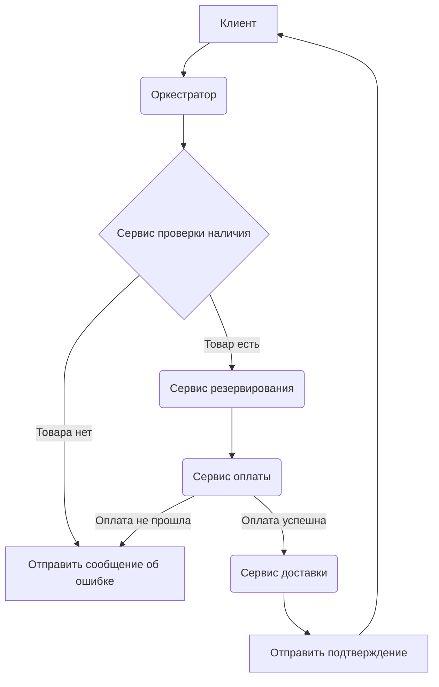
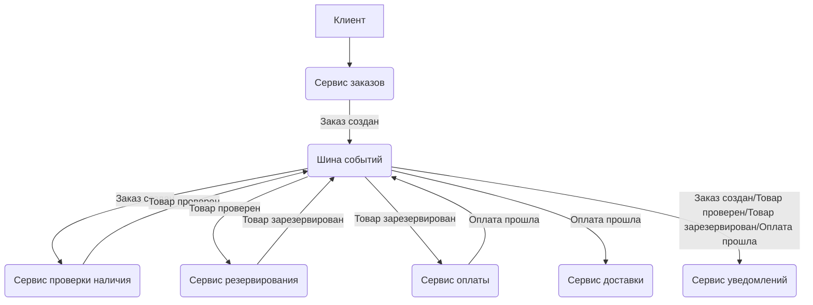

#orchestrationAndChoreography #microservices #architecture #orchestration #choreography #coordination #interaction #decentralization #centralization #eventDriven

# Оркестрация и Хореография в Микросервисной Архитектуре

```table-of-contents
```

## Введение в Оркестрацию и Хореографию

Оркестрация и хореография представляют собой две фундаментальные парадигмы управления взаимодействием между микросервисами в распределенной системе. Оба подхода направлены на обеспечение эффективной координации сервисов, но реализуют это разными способами, каждый из которых имеет свои преимущества и недостатки, а также области применения. Понимание различий между оркестрацией и хореографией критически важно для проектирования надежных, масштабируемых и гибких микросервисных систем.

## Оркестрация

Оркестрация микросервисов характеризуется наличием централизованного компонента, обычно называемого оркестратором. Этот оркестратор действует как "дирижер", управляя потоком запросов и ответов между различными микросервисами. Оркестратор знает всю последовательность операций, необходимых для выполнения бизнес-процесса, и явно вызывает соответствующие микросервисы в нужном порядке.

### Принцип работы оркестрации

1.  **Централизованное управление**: Оркестратор содержит логику бизнес-процесса и управляет его выполнением. Он инициирует запросы к микросервисам, обрабатывает их ответы и принимает решения о дальнейших действиях.
2.  **Явные вызовы**: Оркестратор явно вызывает каждый микросервис, указывая, какие операции должны быть выполнены. Это обеспечивает четкий контроль над потоком выполнения.
3.  **Синхронное взаимодействие (часто)**: Хотя оркестрация может использовать и асинхронные вызовы, часто она предполагает синхронное взаимодействие, когда оркестратор ожидает ответа от микросервиса перед переходом к следующему шагу.

### Преимущества оркестрации

*   **Простота понимания и отладки**: Благодаря централизованному управлению, логика бизнес-процесса сосредоточена в одном месте, что упрощает его понимание, отладку и модификацию.
*   **Контроль над транзакциями**: Оркестратор может управлять транзакциями, охватывающими несколько микросервисов, обеспечивая целостность данных.
*   **Мониторинг и управление**: Централизованный оркестратор облегчает мониторинг выполнения бизнес-процесса и управление им.

### Недостатки оркестрации

*   **Единая точка отказа**: Оркестратор может стать единой точкой отказа, что снижает отказоустойчивость системы.
*   **Жесткая связь**: Микросервисы тесно связаны с оркестратором, что затрудняет их независимое развертывание и масштабирование.
*   **Сложность при масштабировании**: Масштабирование оркестратора может быть сложной задачей, особенно при большом количестве микросервисов и высокой нагрузке.

### Пример оркестрации

Рассмотрим процесс оформления заказа в интернет-магазине. Оркестратор может выполнять следующие шаги:

1.  Получить запрос на оформление заказа.
2.  Вызвать сервис проверки наличия товара.
3.  Если товар в наличии, вызвать сервис резервирования товара.
4.  Вызвать сервис оплаты.
5.  Если оплата прошла успешно, вызвать сервис доставки.
6.  Отправить подтверждение заказа пользователю.



## Хореография

Хореография, в отличие от оркестрации, представляет собой децентрализованный подход к управлению взаимодействием микросервисов. В хореографической архитектуре нет центрального координатора. Вместо этого микросервисы взаимодействуют друг с другом, обмениваясь событиями. Каждый микросервис "слушает" определенные события и реагирует на них, выполняя свою часть работы.

### Принцип работы хореографии

1.  **Децентрализованное управление**: Нет единого компонента, управляющего потоком выполнения. Микросервисы взаимодействуют друг с другом напрямую.
2.  **Обмен событиями**: Микросервисы публикуют события, сигнализирующие о выполнении определенных действий, и подписываются на события, которые им интересны.
3.  **Асинхронное взаимодействие**: Хореография обычно использует асинхронное взаимодействие, основанное на обмене сообщениями.
4.  **Реактивность**: Микросервисы реагируют на события, выполняя свои задачи и публикуя новые события.

### Преимущества хореографии

*   **Слабая связь**: Микросервисы слабо связаны друг с другом, что облегчает их независимое развертывание, масштабирование и модификацию.
*   **Высокая отказоустойчивость**: Отсутствие единой точки отказа повышает отказоустойчивость системы.
*   **Гибкость и расширяемость**: Легко добавлять новые микросервисы или изменять существующие, не затрагивая другие части системы.

### Недостатки хореографии

*   **Сложность понимания и отладки**: Отсутствие централизованного управления затрудняет понимание общего потока выполнения и отладку ошибок.
*   **Сложность мониторинга**: Мониторинг распределенного бизнес-процесса может быть сложной задачей.
*   **Проблемы с согласованностью данных**: Сложнее обеспечить согласованность данных между микросервисами, особенно при наличии сбоев.

### Пример хореографии

Вернемся к примеру с оформлением заказа. В хореографической архитектуре процесс может выглядеть следующим образом:

1.  Сервис заказов публикует событие "Заказ создан".
2.  Сервис проверки наличия товара, подписанный на это событие, проверяет наличие товара и публикует событие "Товар проверен" (с указанием наличия или отсутствия).
3.  Если товар в наличии, сервис резервирования товара, подписанный на событие "Товар проверен", резервирует товар и публикует событие "Товар зарезервирован".
4.  Сервис оплаты, подписанный на событие "Товар зарезервирован", обрабатывает оплату и публикует событие "Оплата прошла" (с указанием успеха или неудачи).
5.  Сервис доставки, подписанный на событие "Оплата прошла", организует доставку и публикует событие "Заказ доставлен".
6.  Сервис уведомлений, подписанный на различные события, отправляет пользователю уведомления о статусе заказа.



## Сравнение Оркестрации и Хореографии

| Характеристика        | Оркестрация                                                                                                            | Хореография                                                                                                                         |
| :-------------------- | :--------------------------------------------------------------------------------------------------------------------- | :---------------------------------------------------------------------------------------------------------------------------------- |
| Управление           | Централизованное (оркестратор)                                                                                            | Децентрализованное (обмен событиями)                                                                                                  |
| Связь                | Жесткая (микросервисы зависят от оркестратора)                                                                            | Слабая (микросервисы взаимодействуют друг с другом через события)                                                                      |
| Отказоустойчивость   | Ниже (оркестратор - единая точка отказа)                                                                                    | Выше (нет единой точки отказа)                                                                                                     |
| Масштабируемость    | Сложнее (масштабирование оркестратора может быть проблемой)                                                                  | Проще (микросервисы могут масштабироваться независимо)                                                                                |
| Понимание и отладка | Проще (логика бизнес-процесса сосредоточена в одном месте)                                                                  | Сложнее (логика распределена между микросервисами)                                                                                     |
| Согласованность     | Проще обеспечить (оркестратор может управлять транзакциями)                                                                | Сложнее обеспечить (требуются дополнительные механизмы, такие как [[Saga Pattern]])                                                |
| Гибкость            | Менее гибкая (изменения в бизнес-процессе требуют модификации оркестратора)                                               | Более гибкая (легко добавлять новые микросервисы или изменять существующие)                                                            |
| Сложность реализации | Может быть проще для простых бизнес-процессов                                                                            | Может быть проще для сложных, распределенных бизнес-процессов с большим количеством взаимодействующих микросервисов                  |
| Примеры             | Обработка заказов, управление пользователями, регистрация                                                                | Рассылка уведомлений, обработка событий, аналитика в реальном времени, системы, построенные на принципах [[Event Sourcing]] и [[CQRS]] |

## Выбор между Оркестрацией и Хореографией: рекомендации

Выбор между оркестрацией и хореографией зависит от множества факторов, включая сложность бизнес-процессов, требования к масштабируемости, отказоустойчивости и гибкости системы. Вот несколько рекомендаций:

*   **Простые бизнес-процессы**: Для простых бизнес-процессов с небольшим количеством шагов и микросервисов оркестрация может быть более простым и понятным решением.
*   **Сложные бизнес-процессы**: Для сложных бизнес-процессов с большим количеством взаимодействующих микросервисов хореография может обеспечить большую гибкость и масштабируемость.
*   **Требования к отказоустойчивости**: Если требуется высокая отказоустойчивость, хореография является предпочтительным выбором из-за отсутствия единой точки отказа.
*   **Требования к масштабируемости**: Если требуется независимое масштабирование микросервисов, хореография обеспечивает большую гибкость.
*   **Требования к согласованности данных**: Если требуется строгая согласованность данных между микросервисами, оркестрация может упростить управление транзакциями. Однако и в хореографии можно обеспечить согласованность данных, используя такие паттерны как [[Saga Pattern]].
* **Быстро меняющиеся требования**: Если бизнес требования и процессы часто меняются, то хореография предоставит больше гибкости, так как изменение одного сервиса (или добавление нового) не затрагивает другие сервисы.

Важно отметить, что оркестрация и хореография не являются взаимоисключающими подходами. Их можно комбинировать в рамках одной системы, используя оркестрацию для управления высокоуровневыми бизнес-процессами, а хореографию – для взаимодействия между микросервисами внутри этих процессов. Так же возможно постепенное внедрение, например начать с оркестрации как более простого решения, а затем переходить на хореографию.

## Пример реализации оркестрации на Go (упрощенный)

Предположим, у нас есть три микросервиса: `orderService`, `paymentService` и `deliveryService`. Оркестратор будет координировать их взаимодействие.

```go
package main

import (
	"fmt"
	"log"
	"net/http"
	"time"
)

// orderService - имитация сервиса заказов
func orderService(orderID string) (string, error) {
	// Имитация обработки заказа
	time.Sleep(1 * time.Second)
	return "Order " + orderID + " processed", nil
}

// paymentService - имитация сервиса оплаты
func paymentService(orderID string) (string, error) {
	// Имитация обработки оплаты
	time.Sleep(500 * time.Millisecond)
	return "Payment for order " + orderID + " processed", nil
}

// deliveryService - имитация сервиса доставки
func deliveryService(orderID string) (string, error) {
	// Имитация организации доставки
	time.Sleep(2 * time.Second)
	return "Delivery for order " + orderID + " arranged", nil
}

// orchestrator - функция-оркестратор
func orchestrator(w http.ResponseWriter, r *http.Request) {
	orderID := r.URL.Query().Get("orderID")
	if orderID == "" {
		http.Error(w, "orderID is required", http.StatusBadRequest)
		return
	}

	// Шаг 1: Обработка заказа
	orderResult, err := orderService(orderID)
	if err != nil {
		http.Error(w, err.Error(), http.StatusInternalServerError)
		return
	}
	fmt.Fprintln(w, orderResult)

	// Шаг 2: Обработка оплаты
	paymentResult, err := paymentService(orderID)
	if err != nil {
		http.Error(w, err.Error(), http.StatusInternalServerError)
		return
	}
	fmt.Fprintln(w, paymentResult)

	// Шаг 3: Организация доставки
	deliveryResult, err := deliveryService(orderID)
	if err != nil {
		http.Error(w, err.Error(), http.StatusInternalServerError)
		return
	}
	fmt.Fprintln(w, deliveryResult)

	fmt.Fprintln(w, "Order "+orderID+" completed successfully")
}

func main() {
	http.HandleFunc("/orchestrate", orchestrator)
	log.Fatal(http.ListenAndServe(":8080", nil))
}

```

В этом примере функция `orchestrator` действует как оркестратор.  Она последовательно вызывает функции `orderService`, `paymentService` и `deliveryService`, имитирующие работу соответствующих микросервисов. Каждый вызов представляет собой отдельный шаг бизнес-процесса. Оркестратор обрабатывает ошибки, возникающие на каждом шаге.

## Пример реализации хореографии на Go (упрощенный)

В этом примере мы будем использовать канал Go в качестве простой шины сообщений для обмена событиями между микросервисами.

```go
package main

import (
	"fmt"
	"log"
	"time"
)

// Event - структура события
type Event struct {
	Type    string
	OrderID string
}

// eventBus - канал для обмена событиями
var eventBus = make(chan Event)

// orderService - сервис заказов
func orderService() {
	for i := 1; ; i++ {
		orderID := fmt.Sprintf("%d", i)
		fmt.Println("Order Service: Creating order", orderID)
		eventBus <- Event{Type: "OrderCreated", OrderID: orderID}
		time.Sleep(2 * time.Second)
	}
}

// paymentService - сервис оплаты
func paymentService() {
	for event := range eventBus {
		if event.Type == "OrderCreated" {
			fmt.Println("Payment Service: Processing payment for order", event.OrderID)
			// Имитация обработки оплаты
			time.Sleep(1 * time.Second)
			eventBus <- Event{Type: "PaymentProcessed", OrderID: event.OrderID}
		}
	}
}

// deliveryService - сервис доставки
func deliveryService() {
	for event := range eventBus {
		if event.Type == "PaymentProcessed" {
			fmt.Println("Delivery Service: Arranging delivery for order", event.OrderID)
			// Имитация организации доставки
			time.Sleep(3 * time.Second)
			fmt.Println("Delivery Service: Order", event.OrderID, "delivered")
		}
	}
}

func main() {
	go orderService()
	go paymentService()
	go deliveryService()

	// Предотвращаем завершение программы
	select {}
}

```

В этом примере три горутины (`orderService`, `paymentService`, `deliveryService`) имитируют работу микросервисов. Они взаимодействуют друг с другом через канал `eventBus`, который действует как простая шина сообщений. Сервис заказов создает заказы и публикует события "OrderCreated". Сервис оплаты "слушает" эти события и обрабатывает оплату, публикуя события "PaymentProcessed". Сервис доставки "слушает" события "PaymentProcessed" и организует доставку.

Эти примеры являются упрощенными и служат для иллюстрации основных принципов оркестрации и хореографии. В реальных приложениях используются более сложные механизмы, такие как брокеры сообщений (например, RabbitMQ, Kafka), системы управления рабочими процессами (например, Camunda, Zeebe), API-шлюзы и т.д.

## Заключение

Оркестрация и хореография – это два мощных подхода к построению микросервисных архитектур. Выбор между ними зависит от конкретных требований к системе. Оркестрация лучше подходит для простых и понятных бизнес-процессов, где важен централизованный контроль и согласованность данных. Хореография предпочтительнее для сложных, распределенных систем, где важна гибкость, масштабируемость и отказоустойчивость. В реальных системах эти подходы могут комбинироваться для достижения оптимального результата.

```old
Оркестрация и хореография – это два разных подхода к координации и взаимодействию микросервисов в архитектуре. Давайте рассмотрим их:

1. **Оркестрация**:
   - Оркестрация предполагает наличие **единого центра управления**, который "дирижирует всем оркестром".
   - В этом стиле, оркестратор направляет запросы к различным микросервисам в зависимости от обрабатываемой бизнес-логики.
   - Оркестрация подходит для сценариев, где нужно согласованно управлять различными сервисами, например, при обработке заказов в интернет-магазине.

2. **Хореография**:
   - Хореография – это **децентрализованный подход** к оркестровке и коммуникации между сервисами.
   - В хореографии нет явно определенного рабочего процесса. Работа сервисов реализуется реактивно, по реакции на определенные события.
   - Этот стиль подходит для сценариев с частым обновлением или заменой сервисов, а также для serverless-платформ.

Выбор между оркестрацией и хореографией зависит от конкретных требований вашей системы и ее сложности. Каждый из этих подходов имеет свои плюсы и минусы, и важно выбрать наиболее подходящий для вашего контекста. Если у вас есть дополнительные вопросы, не стесняйтесь спрашивать!

```