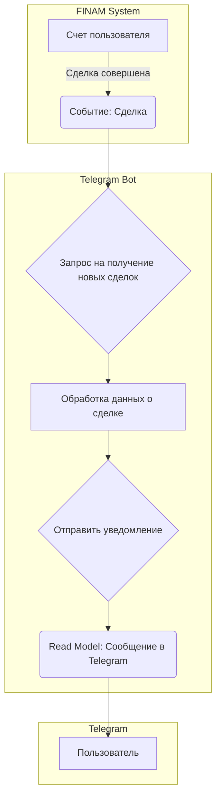

#RequestForProposal #FINAM #Telegram #API #Go #EventModeling #TDD #Trading #Bot #PetProject

# Разработка Telegram-бота для трансляции сделок ФИНАМ

```table-of-contents
```

## Введение

Предлагаемый pet-проект представляет собой разработку Telegram-бота, который будет транслировать сделки, совершаемые на торговом счете ФИНАМ. Этот проект позволит на практике применить знания и навыки в области программирования на Go, работы с API, разработки ботов для Telegram, а также освоить методологии Event Modeling и TDD (Test-Driven Development). Проект включает в себя интеграцию с API ФИНАМ, обработку данных о сделках и отправку уведомлений в Telegram.

## Детальный разбор задачи

Задача разбивается на несколько подзадач, каждая из которых будет подробно рассмотрена ниже:

1.  **Изучение документации API ФИНАМ:** Необходимо тщательно ознакомиться с документацией API ФИНАМ, чтобы понять, какие методы предоставляются для получения информации о сделках, какие параметры необходимо передавать, и в каком формате возвращаются данные.
2.  **Регистрация в ФИНАМ и получение токена:** Для доступа к API потребуется зарегистрироваться в ФИНАМ, создать демо-счет (или использовать реальный) и получить токен авторизации.
3.  **Разработка Telegram-бота:** Создание базовой структуры бота на Go, которая будет обрабатывать входящие запросы и отправлять сообщения.
4.  **Интеграция с API ФИНАМ:** Написание кода для подключения к API ФИНАМ, получения данных о сделках и их обработки.
5.  **Формирование и отправка уведомлений в Telegram:** Преобразование полученных данных о сделках в удобный для чтения формат и отправка их в Telegram-канал или чат.
6.  **Применение Event Modeling:** Проектирование системы с использованием методологии Event Modeling для наглядного представления потоков событий и данных.
7.  **Применение TDD:** Разработка тестов на каждом этапе создания функциональности, следуя принципам Test-Driven Development.
8.  **(Опционально) Интеграция с другими ботами:** Расширение функциональности путем интеграции с существующими ботами, которые предоставляют информацию об инвестициях и спекуляциях.

## Шаг 1: Изучение документации API ФИНАМ

Документация API ФИНАМ доступна по ссылке: [https://finamweb.github.io/trade-api-docs/](https://finamweb.github.io/trade-api-docs/).

Ключевые разделы документации для данного проекта:

*   **Авторизация:** Описание процесса получения токена и его использования в запросах.
*   **Сделки:** Информация о методах получения данных о сделках. Вероятно, потребуется использовать метод, позволяющий получать информацию о новых сделках в режиме реального времени или с минимальной задержкой. Нужно обратить внимание на параметры запроса, такие как период времени, идентификатор счета и т.д.
*   **Формат данных:** Описание структуры данных, возвращаемых API. Важно понять, какие поля содержат информацию о дате и времени сделки, инструменте, цене, объеме и других параметрах.

## Шаг 2: Регистрация в ФИНАМ и получение токена

Для получения доступа к API необходимо зарегистрироваться на сайте ФИНАМ ([https://www.finam.ru/](https://www.finam.ru/)) и создать демо-счет (или использовать реальный счет, если он имеется). После регистрации и создания счета необходимо получить токен API. Процесс получения токена может отличаться в зависимости от интерфейса ФИНАМ, но обычно он включает в себя следующие шаги:

1.  Переход в раздел управления API (название раздела может варьироваться).
2.  Создание нового токена.
3.  Указание необходимых разрешений для токена (например, разрешение на чтение информации о сделках).
4.  Сохранение сгенерированного токена. Токен представляет собой строку, которую необходимо будет использовать в заголовках запросов к API.

## Шаг 3: Разработка Telegram-бота

Для создания Telegram-бота на Go можно использовать одну из популярных библиотек, например, `go-telegram-bot-api`.

Пример базовой структуры бота:

```go
package main

import (
	"log"
	"os"

	tgbotapi "github.com/go-telegram-bot-api/telegram-bot-api/v5"
)

func main() {
	// Получаем токен бота из переменной окружения.
	botToken := os.Getenv("TELEGRAM_BOT_TOKEN")

	// Создаем новый экземпляр бота.
	bot, err := tgbotapi.NewBotAPI(botToken)
	if err != nil {
		log.Panic(err)
	}

	bot.Debug = true

	log.Printf("Authorized on account %s", bot.Self.UserName)

	// Создаем канал для получения обновлений.
	u := tgbotapi.NewUpdate(0)
	u.Timeout = 60

	updates := bot.GetUpdatesChan(u)

	// Обрабатываем обновления.
	for update := range updates {
		if update.Message != nil { // Если получили сообщение.
			log.Printf("[%s] %s", update.Message.From.UserName, update.Message.Text)

			msg := tgbotapi.NewMessage(update.Message.Chat.ID, update.Message.Text)
			msg.ReplyToMessageID = update.Message.MessageID

			_, err := bot.Send(msg)
            if err != nil {
                log.Println("Ошибка отправки сообщения:", err)
            }
		}
	}
}
```

**Пояснение:**

1.  **Получение токена бота:** Токен бота Telegram получается из переменной окружения `TELEGRAM_BOT_TOKEN`. Это рекомендуется для безопасности, чтобы не хранить токен в коде.
2.  **Создание экземпляра бота:** `tgbotapi.NewBotAPI(botToken)` создает новый экземпляр бота, используя полученный токен.
3.  **Включение режима отладки:** `bot.Debug = true` включает режим отладки, который выводит подробную информацию о запросах и ответах бота.
4.  **Получение обновлений:** `bot.GetUpdatesChan(u)` создает канал, через который бот получает обновления (новые сообщения, команды и т.д.).
5.  **Обработка обновлений:** Цикл `for update := range updates` обрабатывает каждое полученное обновление. В данном примере бот просто отвечает на любое сообщение тем же текстом.
6. **Отправка сообщений.** Используется метод `bot.Send(msg)`.

Для запуска бота необходимо установить переменную окружения `TELEGRAM_BOT_TOKEN` и выполнить команду `go run main.go`.

## Шаг 4: Интеграция с API ФИНАМ

Для взаимодействия с API ФИНАМ потребуется использовать HTTP-клиент Go.  Предположим, что API ФИНАМ предоставляет метод `/trades` для получения информации о сделках, и токен необходимо передавать в заголовке `Authorization`.

Пример кода для получения данных о сделках:

```go
package main

import (
	"encoding/json"
	"fmt"
	"io/ioutil"
	"log"
	"net/http"
	"os"
	"time"
)

// Структура для хранения информации о сделке (примерная).
type Trade struct {
	Symbol    string    `json:"symbol"`
	Price     float64   `json:"price"`
	Quantity  float64   `json:"quantity"`
	Timestamp time.Time `json:"timestamp"`
}

func getTrades(finamToken string) ([]Trade, error) {
	// Формируем URL запроса.
	url := "https://api.finam.ru/trades" // Замените на реальный URL.

	// Создаем HTTP-клиент.
	client := &http.Client{}

	// Создаем запрос.
	req, err := http.NewRequest("GET", url, nil)
	if err != nil {
		return nil, err
	}

	// Добавляем заголовок с токеном.
	req.Header.Add("Authorization", "Bearer "+finamToken)

	// Выполняем запрос.
	resp, err := client.Do(req)
	if err != nil {
		return nil, err
	}
	defer resp.Body.Close()

	// Читаем тело ответа.
	body, err := ioutil.ReadAll(resp.Body)
	if err != nil {
		return nil, err
	}

	// Проверяем код ответа.
	if resp.StatusCode != http.StatusOK {
		return nil, fmt.Errorf("API returned error: %s, body: %s", resp.Status, string(body))
	}
	// Распаковываем JSON-ответ в структуру Trade.
	var trades []Trade
	err = json.Unmarshal(body, &trades)
	if err != nil {
		return nil, err
	}

	return trades, nil
}

func main() {
    finamToken := os.Getenv("FINAM_API_TOKEN")
    if finamToken == "" {
        log.Fatal("FINAM_API_TOKEN environment variable not set")
    }

    trades, err := getTrades(finamToken)
    if err != nil {
        log.Fatal(err)
    }

    for _, trade := range trades {
        fmt.Printf("Symbol: %s, Price: %.2f, Quantity: %.2f, Timestamp: %s\n",
            trade.Symbol, trade.Price, trade.Quantity, trade.Timestamp)
    }
}

```

**Пояснение:**

1.  **Структура `Trade`:** Определяет структуру для хранения информации о сделке. Поля структуры должны соответствовать полям, возвращаемым API ФИНАМ.
2.  **Функция `getTrades`:**
    *   Принимает токен ФИНАМ в качестве аргумента.
    *   Формирует URL запроса к API.
    *   Создает HTTP-клиент и запрос.
    *   Добавляет заголовок `Authorization` с токеном.
    *   Выполняет запрос.
    *   Читает и распаковывает JSON-ответ в массив структур `Trade`.
    *   Возвращает массив сделок и ошибку (если она возникла).
3. **Получение токена в `main`:** Токен получается из переменной окружения `FINAM_API_TOKEN`.
4. **Вывод полученных данных** В цикле выводится информация по каждой сделке.

## Шаг 5: Формирование и отправка уведомлений в Telegram

Полученные данные о сделках необходимо преобразовать в удобный для чтения формат и отправить в Telegram.

Пример интеграции с Telegram-ботом:

```go
package main

import (
	"encoding/json"
	"fmt"
	"io/ioutil"
	"log"
	"net/http"
	"os"
	"time"
    tgbotapi "github.com/go-telegram-bot-api/telegram-bot-api/v5"
)

// Trade struct (same as before)
type Trade struct {
	Symbol    string    `json:"symbol"`
	Price     float64   `json:"price"`
	Quantity  float64   `json:"quantity"`
	Timestamp time.Time `json:"timestamp"`
}

// getTrades function (same as before)
func getTrades(finamToken string) ([]Trade, error) {
	url := "https://api.finam.ru/trades" // Замените на реальный URL.
	client := &http.Client{}
	req, err := http.NewRequest("GET", url, nil)
	if err != nil {
		return nil, err
	}
	req.Header.Add("Authorization", "Bearer "+finamToken)
	resp, err := client.Do(req)
	if err != nil {
		return nil, err
	}
	defer resp.Body.Close()
	body, err := ioutil.ReadAll(resp.Body)
	if err != nil {
		return nil, err
	}
	if resp.StatusCode != http.StatusOK {
		return nil, fmt.Errorf("API returned error: %s, body: %s", resp.Status, string(body))
	}
	var trades []Trade
	err = json.Unmarshal(body, &trades)
	if err != nil {
		return nil, err
	}
	return trades, nil
}

func main() {
    finamToken := os.Getenv("FINAM_API_TOKEN")
    botToken := os.Getenv("TELEGRAM_BOT_TOKEN")
    chatIDStr := os.Getenv("TELEGRAM_CHAT_ID")

    if finamToken == "" || botToken == "" || chatIDStr == ""{
        log.Fatal("FINAM_API_TOKEN, TELEGRAM_BOT_TOKEN and TELEGRAM_CHAT_ID environment variables must be set")
    }

    chatID, err := strconv.ParseInt(chatIDStr, 10, 64)
	if err != nil {
		log.Fatalf("Invalid TELEGRAM_CHAT_ID: %v", err)
	}

    bot, err := tgbotapi.NewBotAPI(botToken)
    if err != nil {
        log.Panic(err)
    }
    log.Printf("Authorized on account %s", bot.Self.UserName)

    // Получаем сделки и отправляем уведомления.
    for { // Бесконечный цикл для постоянного мониторинга.
        trades, err := getTrades(finamToken)
        if err != nil {
            log.Println("Error getting trades:", err)
            time.Sleep(60 * time.Second) // Пауза перед повторной попыткой.
            continue
        }

        for _, trade := range trades {
            // Формируем сообщение.
            messageText := fmt.Sprintf("Новая сделка!\nИнструмент: %s\nЦена: %.2f\nКоличество: %.2f\nВремя: %s",
                trade.Symbol, trade.Price, trade.Quantity, trade.Timestamp.Format(time.RFC1123))

            // Отправляем сообщение.
            msg := tgbotapi.NewMessage(chatID, messageText)
            _, err = bot.Send(msg)
            if err != nil {
                log.Println("Error sending message:", err)
            }
        }

        time.Sleep(60 * time.Second) // Пауза между проверками новых сделок.
    }
}
```

**Пояснение:**

1. **Получение необходимых переменных окружения:** Добавлены переменные окружения `TELEGRAM_BOT_TOKEN` и `TELEGRAM_CHAT_ID`. `TELEGRAM_CHAT_ID` – это идентификатор чата или канала, куда будут отправляться уведомления. Его нужно получить при настройке бота.
2.  **Преобразование `chatIDStr` в `int64`:** `TELEGRAM_CHAT_ID` приходит как строка, поэтому необходимо преобразовать в число.
3.  **Бесконечный цикл:** Добавлен бесконечный цикл `for {}`, который позволяет боту постоянно проверять наличие новых сделок.
4.  **Формирование сообщения:** Внутри цикла формируется строка `messageText` с информацией о сделке.
5.  **Отправка сообщения:** `tgbotapi.NewMessage(chatID, messageText)` создает новое сообщение, а `bot.Send(msg)` отправляет его.
6.  **Пауза:** `time.Sleep(60 * time.Second)` добавляет паузу между проверками новых сделок. Длительность паузы можно настроить.

## Шаг 6: Применение Event Modeling

Event Modeling - это методология визуализации информационных систем, основанная на потоках событий. Она помогает понять, как система работает, какие события происходят, и как они влияют на состояние системы.

Для данного проекта Event Modeling можно применить следующим образом:

1.  **Определение событий:** Основное событие в системе - это "Сделка совершена". Это событие инициирует процесс получения данных о сделке и отправки уведомления.
2.  **Определение команд:** Команда, которая приводит к событию "Сделка совершена", - это "Запрос на получение новых сделок" (которая неявно выполняется системой ФИНАМ). Команда "Отправить уведомление" инициируется нашим ботом после обработки данных.
3.  **Определение Read Models:** Read Model - это представление данных, необходимое для отображения информации пользователю. В данном случае Read Model - это сообщение, отправляемое в Telegram.
4. **Определение агрегатов:** В этом простом случае, агрегатом можно считать сам счет пользователя в системе ФИНАМ.

**Схема Event Modeling (упрощенная):**



**Пояснения к схеме:**

*   **FINAM System:** Представляет систему ФИНАМ, где происходит основное событие - совершение сделки.
*   **Telegram Bot:** Наш бот, который обрабатывает событие и отправляет уведомление.
*   **Telegram:** Мессенджер Telegram, где пользователь получает уведомление.
*   **Счет пользователя:** Агрегат - счет пользователя в ФИНАМ.
*   **Сделка совершена:** Событие, которое происходит в системе ФИНАМ.
*   **Запрос на получение новых сделок:** Команда (неявная, выполняется системой ФИНАМ).
* **Обработка данных о сделке:** Промежуточный шаг обработки, где бот форматирует данные.
*   **Отправить уведомление:** Команда, которую выполняет бот.
*   **Read Model: Сообщение в Telegram:** Представление данных для пользователя.
*  **Пользователь:** Получатель уведомления.

Эта схема показывает поток событий от момента совершения сделки до получения уведомления пользователем.  Она помогает визуализировать процесс и понять, как взаимодействуют различные компоненты системы.

## Шаг 7: Применение TDD

Test-Driven Development (TDD) - это методология разработки, при которой сначала пишутся тесты, а затем код, который эти тесты проходит.

Применение TDD к данному проекту:

1.  **Написание теста для функции `getTrades`:**
    *   Создаем файл `main_test.go`.
    *   Пишем тест, который проверяет, что функция `getTrades` возвращает корректные данные (или ошибку, если API недоступен или возвращает ошибку).  Для этого можно использовать моки (mock objects) или тестовый сервер, имитирующий API ФИНАМ.

    ```go
    package main

    import (
    	"testing"
    	"time"
        "net/http"
        "net/http/httptest"
        "encoding/json"
    )

    func TestGetTrades(t *testing.T) {
    	// Создаем тестовый сервер.
        ts := httptest.NewServer(http.HandlerFunc(func(w http.ResponseWriter, r *http.Request) {
            // Проверяем заголовок Authorization.
            if r.Header.Get("Authorization") != "Bearer test_token" {
                w.WriteHeader(http.StatusUnauthorized)
                return
            }

            // Формируем тестовые данные.
            trades := []Trade{
                {Symbol: "AAPL", Price: 150.0, Quantity: 10, Timestamp: time.Now()},
                {Symbol: "GOOG", Price: 2500.0, Quantity: 5, Timestamp: time.Now()},
            }

            // Кодируем данные в JSON и отправляем в ответ.
            json.NewEncoder(w).Encode(trades)
        }))
        defer ts.Close()

        // Переопределяем URL API на адрес тестового сервера.
        url = ts.URL

        // Вызываем функцию getTrades.
        trades, err := getTrades("test_token")

        // Проверяем, что не возникло ошибки.
        if err != nil {
            t.Fatalf("getTrades returned an error: %v", err)
        }

        // Проверяем, что количество сделок совпадает с ожидаемым.
        if len(trades) != 2 {
            t.Fatalf("Expected 2 trades, got %d", len(trades))
        }

        // Проверяем данные первой сделки.
        if trades[0].Symbol != "AAPL" {
            t.Errorf("Expected first trade symbol to be AAPL, got %s", trades[0].Symbol)
        }
        // ... (добавьте проверки для других полей)
    }

    func TestGetTrades_Unauthorized(t *testing.T) {
        // Создаем тестовый сервер, который возвращает ошибку 401.
        ts := httptest.NewServer(http.HandlerFunc(func(w http.ResponseWriter, r *http.Request) {
            w.WriteHeader(http.StatusUnauthorized)
        }))
        defer ts.Close()

        // Переопределяем URL API на адрес тестового сервера.
        url = ts.URL

        // Вызываем функцию getTrades с неверным токеном.
        _, err := getTrades("invalid_token")

        // Проверяем, что возникла ошибка.
        if err == nil {
            t.Fatal("Expected an error, got nil")
        }
    }
    ```

2.  **Запуск теста:** Выполняем команду `go test`. Тест должен провалиться, так как функция `getTrades` еще не реализована (или реализована не полностью).

3.  **Написание кода функции `getTrades`:** Пишем код функции `getTrades` так, чтобы он проходил написанный тест.

4.  **Повторный запуск теста:** Выполняем команду `go test`. Тест должен пройти успешно.

5.  **Рефакторинг:** При необходимости проводим рефакторинг кода, сохраняя при этом его функциональность и прохождение тестов.

Аналогичным образом применяем TDD для других функций и компонентов системы:

*   Функция отправки сообщения в Telegram.
*   Функция форматирования данных о сделке.
*   Обработка ошибок API.
*   Обработка ошибок Telegram.

Преимущества TDD:

*   **Раннее обнаружение ошибок:** Тесты позволяют выявить ошибки на ранних этапах разработки.
*   **Уверенность в коде:** Наличие тестов дает уверенность в том, что код работает правильно.
*   **Улучшение дизайна кода:** TDD способствует созданию более чистого и модульного кода.
*   **Документация:** Тесты служат в качестве документации к коду.

## Шаг 8: (Опционально) Интеграция с другими ботами

Если у вас есть другие боты, которые предоставляют информацию об инвестициях и спекуляциях, можно интегрировать их с новым ботом. Например, можно добавить команду, которая будет запрашивать информацию у другого бота и отправлять ее пользователю.

Варианты интеграции:

*   **Прямой вызов API другого бота:** Если другой бот предоставляет API, можно напрямую вызывать его методы из нового бота.
*   **Использование общей базы данных:** Если боты имеют общую базу данных, можно обмениваться данными через нее.
*   **Обмен сообщениями через Telegram:** Боты могут обмениваться сообщениями через Telegram, используя специальные команды или форматы сообщений.

## Заключение

Этот проект представляет собой отличную возможность для изучения и применения на практике различных технологий и методологий разработки. Он включает в себя работу с API, разработку Telegram-бота, применение Event Modeling и TDD, а также потенциальную интеграцию с другими системами.  Реализация этого проекта позволит получить ценный опыт и создать полезный инструмент для мониторинга сделок на фондовом рынке.

```old
# Request For Proposal (RFP) - FINAM

Лучшее обучение через практику. Могу предложить идею пет-проекта. Это транслятор сделок по торговому счёту ФИНАМ в телегу. Как запилить бот / кастомный клиент телеги - это я умею, есть парочка своих открытых проектов. Всё покажу-расскажу. Только чур через Event Modeling и TDD.

Регаешься в ФИНАМ, получаешь демо-счёт и токен для API. Втыкаешь в примеры резализации бота. Проходишь курс по TDD (я прямо сейчас этим занимаюсь на стриме). Кодишь божественный main.go - в итоге принят в погромисты.

https://finamweb.github.io/trade-api-docs/

> А суть какая программы, будет писать в телегу каждый раз, когда по счету произошли сделки?

Да, я сейчас руками такое делаю по фану для подписчиков канала - с ошибками и задержками. И это только первая часть марлезонского балета, есть ещё идеи по функционалу. Плюс интеграция с моими старыми ботами, которые вытягивают из Сети различную инфу по инвестициям-спекуляциям.

```