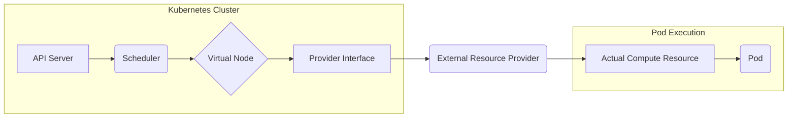

#VirtualNodes #kubernetes #cluster #nodes #virtualization #management #scalability #abstraction #resource #k8s

# Виртуальные узлы в Kubernetes

```table-of-contents
```

## Введение в виртуальные узлы

Виртуальные узлы (Virtual Nodes) в Kubernetes представляют собой абстракцию, позволяющую расширить кластер Kubernetes за пределы физических или виртуальных машин, на которых он изначально развернут. Эта технология позволяет подключать к кластеру ресурсы, предоставляемые различными облачными провайдерами или локальными серверами, без необходимости явного управления этими ресурсами как отдельными узлами. Вместо этого, виртуальные узлы предоставляют уровень абстракции, который позволяет Kubernetes использовать эти ресурсы как часть единого пула. Это достигается за счет создания "виртуального" представления этих ресурсов внутри кластера.

## Принцип работы виртуальных узлов

Принцип работы виртуальных узлов основан на расширении стандартного API Kubernetes. Вместо того, чтобы регистрировать реальные узлы (физические или виртуальные машины), в кластере регистрируется "виртуальный узел", который фактически является прокси-объектом. Этот объект взаимодействует с внешним провайдером ресурсов (например, облачным сервисом) или локальным сервером, обеспечивая выделение и освобождение вычислительных мощностей по требованию.

Когда Kubernetes планировщик решает разместить Pod на виртуальном узле, запрос перенаправляется на провайдера ресурсов, связанного с этим виртуальным узлом. Провайдер, в свою очередь, создает необходимый экземпляр (например, контейнер в облаке) и запускает в нем Pod. Kubernetes при этом "видит" этот Pod как запущенный на обычном узле, хотя физически он может находиться вне основного кластера.

Схематично это можно представить так:



1.  **Запрос на создание Pod**: Пользователь или система отправляет запрос на создание Pod в Kubernetes API Server.
2.  **Планирование**: Kubernetes Scheduler определяет, на каком узле должен быть запущен Pod. Если выбран виртуальный узел, управление передается провайдеру этого узла.
3.  **Взаимодействие с провайдером**: Провайдер виртуального узла получает запрос и взаимодействует с внешним поставщиком ресурсов (например, облачным провайдером).
4.  **Выделение ресурсов**: Внешний поставщик ресурсов выделяет необходимые вычислительные мощности (например, создает виртуальную машину или контейнер).
5.  **Запуск Pod**: Pod запускается на выделенном ресурсе. Kubernetes считает, что Pod запущен на виртуальном узле.
6.  **Взаимодействие с Pod**: Kubernetes API Server взаимодействует с Pod'ом через стандартные механизмы, как если бы он был запущен на обычном узле.

## Преимущества использования виртуальных узлов

Использование виртуальных узлов предоставляет ряд значительных преимуществ:

*   **Масштабируемость**: Виртуальные узлы позволяют легко масштабировать кластер по требованию, подключая дополнительные ресурсы от облачных провайдеров или локальных серверов. Это особенно полезно при пиковых нагрузках или при необходимости быстрого развертывания новых приложений.
*   **Эффективность использования ресурсов**: Виртуальные узлы позволяют более эффективно использовать имеющиеся ресурсы, поскольку они выделяются только тогда, когда это действительно необходимо. Это позволяет избежать простоя ресурсов и снизить затраты.
*   **Упрощение управления**: Виртуальные узлы упрощают управление инфраструктурой, поскольку пользователю не нужно заботиться о создании и настройке отдельных узлов. Все управление осуществляется через стандартный API Kubernetes.
*   **Гибкость**: Виртуальные узлы позволяют использовать различные типы ресурсов (например, виртуальные машины, контейнеры, бессерверные функции) в рамках одного кластера. Это обеспечивает большую гибкость при выборе оптимального решения для конкретных задач.
*   **Изоляция**: Поды, запущенные на виртуальных узлах, могут быть изолированы от основного кластера, что повышает безопасность и надежность.

## Реализации виртуальных узлов

Существует несколько реализаций виртуальных узлов, каждая из которых имеет свои особенности и преимущества.

### Virtual Kubelet

Virtual Kubelet ([https://github.com/virtual-kubelet/virtual-kubelet](https://github.com/virtual-kubelet/virtual-kubelet)) – это open-source проект, реализующий спецификацию Kubernetes Kubelet, но вместо управления локальными контейнерами, он делегирует управление внешним провайдерам. Virtual Kubelet позволяет подключать к кластеру Kubernetes различные ресурсы, такие как:

*   **Облачные контейнерные сервисы**: Azure Container Instances (ACI), AWS Fargate, и другие.
*   **Бессерверные платформы**: AWS Lambda, Azure Functions, и другие.
*   **Локальные серверы**: с помощью пользовательских провайдеров.

Virtual Kubelet работает как прокси между Kubernetes API Server и внешним провайдером ресурсов. Он принимает запросы на создание и управление Pod'ами и перенаправляет их соответствующему провайдеру.

### Другие реализации

Помимо Virtual Kubelet, существуют и другие реализации виртуальных узлов, например:

*   **Azure Kubernetes Service (AKS) Virtual Nodes**: Интегрированное решение для AKS, позволяющее использовать Azure Container Instances в качестве виртуальных узлов ([https://learn.microsoft.com/en-us/azure/aks/virtual-nodes-portal](https://learn.microsoft.com/en-us/azure/aks/virtual-nodes-portal)).
*   **Alibaba Cloud Elastic Container Instance (ECI)**: Интегрированное решение, позволяющее использовать ECI в качестве виртуальных узлов.

## Пример использования Virtual Kubelet с Azure Container Instances (ACI)

Рассмотрим пример использования Virtual Kubelet для подключения Azure Container Instances (ACI) к кластеру Kubernetes.

1.  **Установка Virtual Kubelet**: Virtual Kubelet устанавливается в кластер Kubernetes как обычное приложение. Для этого можно использовать Helm chart или манифесты YAML.

2.  **Настройка провайдера ACI**: Необходимо настроить провайдер ACI для Virtual Kubelet, указав параметры подключения к Azure (подписка, группа ресурсов, учетные данные).

3.  **Создание виртуального узла**: После установки и настройки Virtual Kubelet в кластере появится виртуальный узел, представляющий ACI.

4.  **Развертывание Pod'ов на виртуальном узле**: Теперь можно создавать Pod'ы, указав в спецификации `nodeName` имя виртуального узла. Virtual Kubelet перенаправит запрос в ACI, и Pod будет запущен в контейнере ACI.

Пример YAML манифеста для Pod'а, который будет запущен на виртуальном узле ACI:

```yaml
apiVersion: v1
kind: Pod
metadata:
  name: aci-pod
spec:
  nodeName: virtual-kubelet-aci  # Имя виртуального узла
  containers:
  - name: nginx
    image: nginx:latest
    ports:
    - containerPort: 80
```

В этом примере, Pod с именем `aci-pod` будет запущен на виртуальном узле `virtual-kubelet-aci`, который представляет ACI. Virtual Kubelet обеспечит создание контейнера в ACI и запуск в нем образа `nginx:latest`.

## Сложные концепции

*   **[[Kubelet]]**: Kubelet – это агент, который работает на каждом узле Kubernetes и отвечает за управление контейнерами на этом узле. Virtual Kubelet эмулирует поведение Kubelet, но вместо управления локальными контейнерами, он делегирует управление внешнему провайдеру.
*   **[[Kubernetes API]]**: Kubernetes API – это RESTful API, который предоставляет интерфейс для управления кластером Kubernetes. Virtual Kubelet взаимодействует с Kubernetes API Server, чтобы получать запросы на создание и управление Pod'ами.
*   **[[Provider Interface]]**: Интерфейс провайдера – это абстрактный интерфейс, который определяет, как Virtual Kubelet взаимодействует с внешним провайдером ресурсов. Каждый провайдер (например, ACI, AWS Fargate) реализует этот интерфейс.
*  **[[CRI (Container Runtime Interface)]]** - это плагин, позволяющий kubelet использовать различные среды выполнения контейнеров без необходимости перекомпиляции.
*  **[[CNI (Container Network Interface)]]** - это плагин, позволяющий настраивать сеть для контейнеров в Kubernetes.

## Заключение

Виртуальные узлы в Kubernetes – это мощный инструмент, позволяющий расширить возможности кластера и эффективно использовать ресурсы. Они обеспечивают масштабируемость, гибкость и упрощение управления, делая Kubernetes еще более привлекательным решением для развертывания и управления контейнеризованными приложениями. Различные реализации виртуальных узлов, такие как Virtual Kubelet, позволяют подключать к кластеру различные типы ресурсов, от облачных контейнерных сервисов до бессерверных платформ, открывая широкие возможности для оптимизации инфраструктуры и снижения затрат.

```old
Virtual Nodes
```