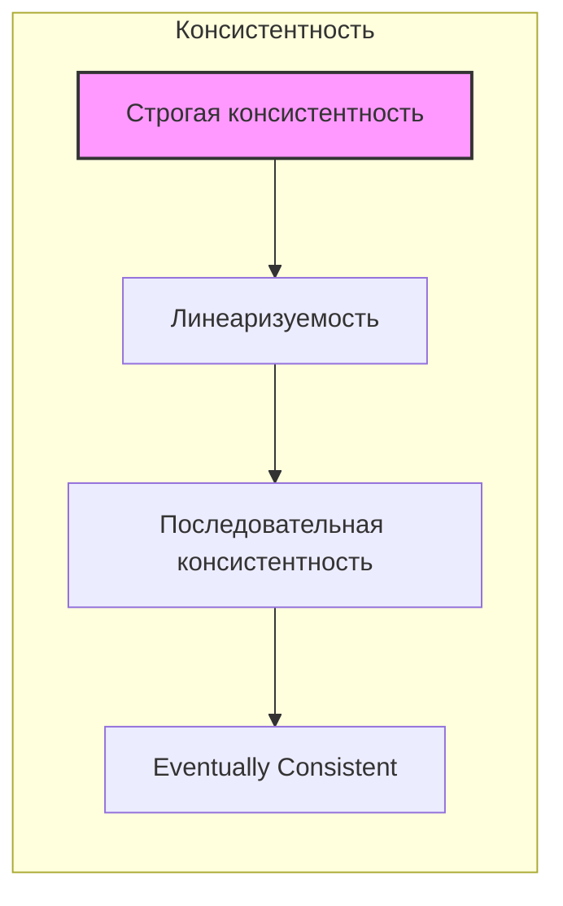

#strictconsistency #consistency #distributed_systems #data_management #linearizability #sequential_consistency #cap_theorem #database #concurrency_control #replication

# Строгая консистентность

```table-of-contents
```

## Введение в строгую консистентность

Строгая консистентность (Strict Consistency) — это самая сильная модель консистентности в распределенных системах. Она гарантирует, что любая операция чтения вернет значение последней завершенной операции записи, независимо от того, на каком узле системы была выполнена эта запись. Это означает, что система ведет себя так, как если бы существовала только одна копия данных, и все операции выполнялись последовательно в едином глобальном порядке.

## Формальное определение

Формально, строгая консистентность определяется следующим образом:

Любое чтение значения переменной  `x` возвращает значение, соответствующее результату самой последней записи в `x`.

Это определение подразумевает наличие глобального времени, относительно которого можно упорядочить все операции.  В реальных распределенных системах достижение абсолютного глобального времени невозможно из-за задержек в сети и различий в тактовых частотах узлов. Однако, строгая консистентность предполагает, что система *ведет себя так*, как будто такое время существует.

## Сравнение с другими моделями консистентности

Строгая консистентность является более сильной моделью, чем, например, последовательная консистентность ([[Sequential Consistency]]) и линеаризуемость ([[Linearizability]]).

*   **Последовательная консистентность:**  Требует, чтобы все операции выполнялись в некотором последовательном порядке, который согласуется с порядком, в котором операции были инициированы каждым отдельным процессом.  Она не требует, чтобы этот порядок соответствовал реальному времени.

*   **Линеаризуемость:**  Требует, чтобы каждая операция выглядела так, как будто она выполняется атомарно в некоторой точке между ее вызовом и завершением.  Линеаризуемость подразумевает наличие глобального порядка операций, соответствующего реальному времени, но не требует, чтобы чтение всегда возвращало самое последнее записанное значение (если запись еще не завершилась).

*   **Строгая консистентность:** Комбинирует требования линеаризуемости и добавляет требование немедленной видимости завершенных записей.

Схематичное сравнение:



## Реализация строгой консистентности

Реализация строгой консистентности в распределенной системе является сложной задачей.  Несколько подходов включают:

1.  **Централизованный сервер:**  Все операции чтения и записи проходят через один центральный сервер, который обеспечивает последовательность и упорядоченность.  Недостатком является единая точка отказа и потенциальная проблема с производительностью.

2.  **Синхронная репликация:**  Каждая операция записи блокирует выполнение до тех пор, пока не будет успешно реплицирована на все узлы системы.  Это гарантирует, что все узлы всегда имеют идентичные данные.  Недостатком является высокая задержка записи и снижение доступности, так как сбой любого узла может заблокировать систему.

3.  **Алгоритмы консенсуса (например, Paxos, Raft):** Эти алгоритмы позволяют группе узлов согласовать порядок операций, даже в присутствии сбоев. Они обеспечивают строгую консистентность, но могут быть сложными в реализации и иметь накладные расходы на производительность.

4. **Использование атомарных часов (Atomic Clocks):** Например, Google Spanner использует TrueTime API, который предоставляет глобально синхронизированные часы. Это позволяет назначать каждой транзакции глобально уникальную метку времени, которая отражает реальное время ее выполнения.

## Пример: Google Spanner

Google Spanner — это глобально распределенная база данных, которая обеспечивает строгую консистентность. Spanner использует комбинацию нескольких технологий для достижения этой цели:

*   **TrueTime API:**  Как упоминалось ранее, TrueTime предоставляет глобально синхронизированные часы, позволяющие назначать транзакциям метки времени, отражающие реальный порядок выполнения.
*   **Двухфазная фиксация (2PC):**  Spanner использует 2PC для обеспечения атомарности транзакций, охватывающих несколько серверов.
*   **Paxos:**  Spanner использует Paxos для репликации данных и обеспечения согласованности между репликами.

## Преимущества и недостатки

**Преимущества:**

*   **Простота программирования:**  Строгая консистентность значительно упрощает разработку приложений, так как программисту не нужно беспокоиться о несогласованности данных.
*   **Предсказуемость:**  Поведение системы предсказуемо, так как все операции выполняются в строгом порядке.
*   **Корректность:** Гарантируется, что данные всегда находятся в согласованном состоянии.

**Недостатки:**

*   **Производительность:**  Достижение строгой консистентности обычно связано с накладными расходами на производительность, так как требуется синхронизация между узлами.
*   **Доступность:**  В некоторых реализациях (например, при синхронной репликации) сбой одного узла может привести к недоступности всей системы.
*   **Сложность:** Реализация строгой консистентности в распределенной системе является сложной задачей.

## Заключение

Строгая консистентность — это самая сильная модель консистентности, обеспечивающая максимальную согласованность данных. Однако она достигается за счет производительности и доступности. Выбор модели консистентности зависит от конкретных требований приложения. В случаях, когда абсолютная согласованность данных критически важна, строгая консистентность является предпочтительным выбором. Если же важнее производительность и доступность, можно рассмотреть более слабые модели консистентности.

```old
Строгая консистентность ([[Strict Consistency]])
```